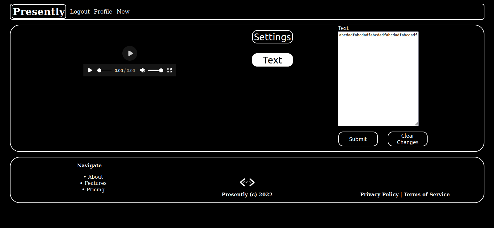

# Presently

Presently is an open-source, full-stack web application written in Python, HTML, CSS, and Javascript. It is currently in development, so pardon the dust.


## Features

- [x] User Accounts 

- [x] Database Integration
- [x] File Uploads
- [ ] Dockerized
- [ ] RabbitMQ Integration
- [ ] Presentation Generator

## QuickStart

Simply copy and paste the following into your terminal to get started!

``` 
git clone https://github.com/NoahGWood/Presently.git
cd Presently/server
chmod +x serve_debug.sh
./serve_debug.sh
```


## Other Views

### Presentation Editing



### New Presentation

